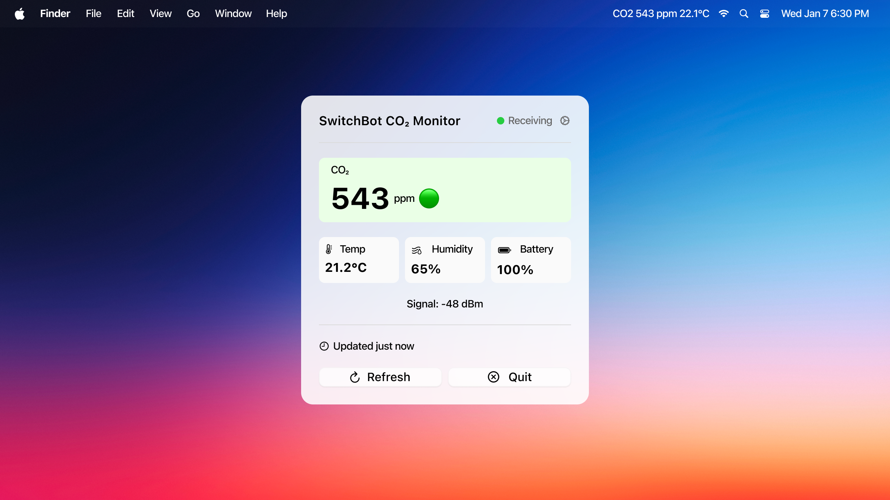

# SwitchBot CO₂ Menu Bar App

A lightweight macOS menu bar app that displays real-time CO₂, temperature, and humidity readings from your **SwitchBot Meter Pro CO₂** (Model W4900010).

Forked from [robjama/Aranet4MenuBar](https://github.com/robjama/Aranet4MenuBar)



## Features

- **Real-time monitoring** - CO₂, temperature, humidity, and battery in your menu bar
- **Visual alerts** - Menu bar turns red when CO₂ exceeds 1400 ppm
- **Notifications** - Get alerted when air quality becomes unhealthy
- **No cloud required** - Reads directly from your device via Bluetooth LE
- **Lightweight** - Native macOS app, minimal resource usage

## Supported Device

- **SwitchBot Meter Pro CO₂** (Model: W4900010)

## Requirements

- macOS 11.0 (Big Sur) or later
- Bluetooth enabled
- SwitchBot Meter Pro CO₂ within Bluetooth range (~10 meters)

## Installation

### Option 1: Download Pre-built App

1. Download the latest release from the [Releases](../../releases) page
2. Unzip `SwitchBotCO2.zip`
3. Move `SwitchBotCO2.app` to your Applications folder
4. **Important:** Since the app is not notarized, you need to allow it:
   - Right-click the app → Open → Click "Open" in the dialog
   - Or run in Terminal: `xattr -cr /Applications/SwitchBotCO2.app`

### Option 2: Build from Source

```bash
git clone https://github.com/YOUR_USERNAME/SwitchBotCO2.git
cd SwitchBotCO2
./build.sh
open build/SwitchBotCO2.app
```

## First Run

1. Launch the app - it will appear in your menu bar
2. macOS will ask for **Bluetooth permission** - click Allow
3. The app will automatically find your SwitchBot Meter Pro CO₂
4. Click the menu bar item to see detailed readings

## CO₂ Level Guide

| Level | CO₂ (ppm) | Indicator | Recommendation |
|-------|-----------|-----------|----------------|
| Good | 400-999 | 🟢 Green | Air quality is excellent |
| Moderate | 1000-1399 | 🟡 Yellow | Consider ventilating |
| Poor | ≥ 1400 | 🔴 Red | Open windows immediately |

## Troubleshooting

### App shows "Scanning..."
- Ensure your SwitchBot device is powered on and nearby
- Check that Bluetooth is enabled on your Mac
- Try moving the device closer (within 5 meters)

### "Unidentified Developer" warning
Run this command in Terminal:
```bash
xattr -cr /Applications/SwitchBotCO2.app
```

### No Bluetooth permission prompt
Go to **System Settings → Privacy & Security → Bluetooth** and add the app manually.

## Technical Details

The app reads BLE advertisement data broadcast by the SwitchBot Meter Pro CO₂. No pairing or connection is required - it passively listens for broadcasts.

**Data format decoded:**
- Manufacturer ID: `0x0969` (SwitchBot)
- CO₂: bytes 15-16 (big-endian)
- Temperature: byte 11 (integer + 128 offset) + byte 10 (decimal ÷ 10)
- Humidity: byte 12
- Battery: byte 9

## Credits

This project is a fork of [Aranet4MenuBar](https://github.com/robjama/Aranet4MenuBar) by robjama, adapted for SwitchBot devices.

## License

MIT License - see [LICENSE](LICENSE) for details.
